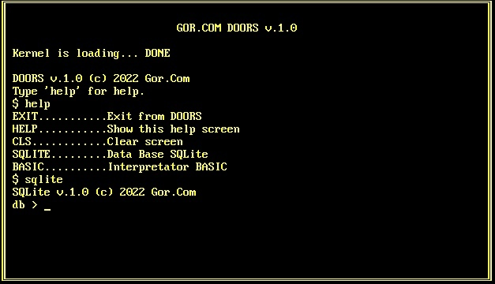
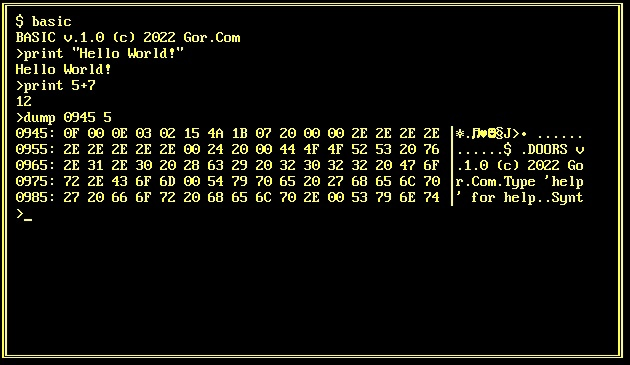

# Операционная система Doors 16-бит

  

Работает в 16-битном реальном режиме процессора x86.  
Видеорежим: Текстовый (80x25).

Содержит:
- командный интерпретатор Shell
- интерпретатор Basic
- СУБД SQLite

В разработке:
- файловая система: FAT12
- прерывания
- процессы и многозадачность 

Написана на Ассемблере x86.

Статус проекта: Разрабатывается.

## Лицензия

Copyright (c) 2022 Evgeny Goryachev
Gor.Com 